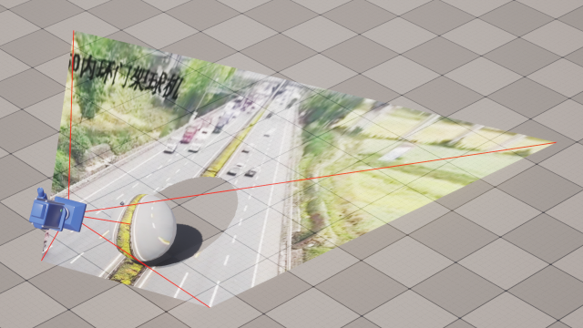
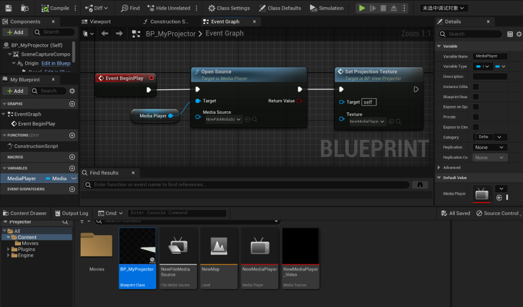
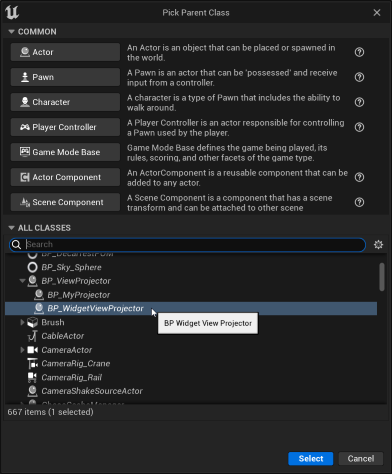
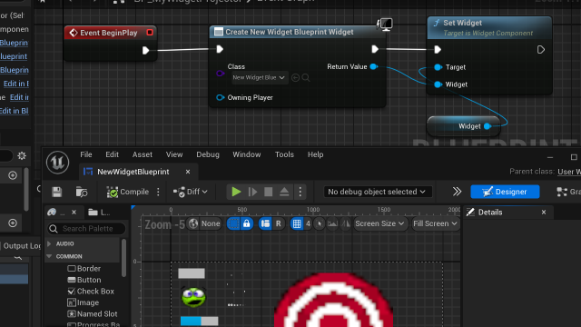
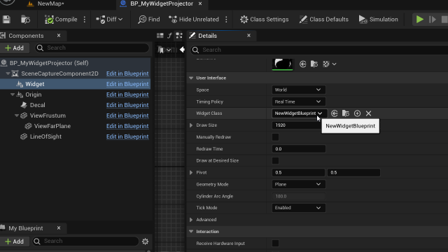

# ViewProjector
使用贴花向场景中投射平面内容 

[视频地址](https://www.bilibili.com/video/BV1uj411a78F)

## 基础用法一

- 如果想把媒体视频投射到场景中, 则需要新建Actor蓝图，父类选择 BP_ViewProjector  

- 在BeginPlay播放媒体，并调用SetProjectionTexture将媒体纹理投射到场景中  

- 点击运行，即可查看效果

## 基础用法二

- 如果想把UMG投射到场景中, 则需要新建Actor蓝图，父类选择 BP_WidgetViewProjector  

- 在BeginPlay处创建控件并将其传给Widget组件  

- 也可以直接选中Widget组件并将控件类传入  

- 运行即可查看投射效果